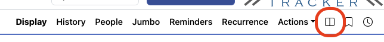
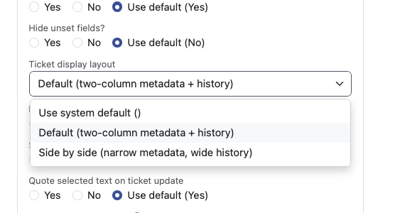

# RT::Extension::SideBySideView

Switchable ticket display layouts for **Request Tracker 6**.

Users can choose between two named page layouts — both via their personal
preferences and via a one-click toggle button directly in the ticket menu bar.
No administrator involvement is required after installation.

---

## What it does

RT 6 renders ticket detail pages using a configurable *PageLayout* system.
This extension registers two alternative layouts and lets each user switch
between them independently:

- **Default View** — the familiar two-column metadata panel above a
  full-width Description + History section.
- **Side-by-Side View** — a narrow metadata column (≈25 % width) placed
  permanently beside a wide History column (≈75 % width), so you can read
  the thread and check ticket details at the same time without scrolling back
  and forth.

Users who have not set a preference continue to see RT's built-in default
layout unchanged — the extension is fully opt-in.

---

## Screenshots

### Layout toggle in the ticket menu bar

A `layout-split` icon button is added to the ticket menu bar next to the
Bookmark (🔖) and Timer (🕐) buttons. One click switches the layout and
reloads the ticket.



### User Preferences

The chosen layout is also available as a persistent per-user setting under
*Preferences → Ticket display → Ticket display layout*. Changes made via the
toggle button are immediately reflected here, and vice versa.



---

## Layouts in detail

### Default View

Two equal columns for metadata, full-width sections below.

| Left column | Right column |
|-------------|--------------|
| Basics, Times, Custom Fields, People, Attachments, Requestors | Reminders, Articles, Dates, Linked Queues, Assets, Links |

Below (full width): **Description · History**

### Side-by-Side View

Narrow metadata column next to a wide transaction history.

| Metadata (col-md-3) | History (col-md-9) |
|---------------------|---------------------|
| Basics, People, Dates, Times, Attachments, Custom Fields, Links, Requestors, Articles, Assets | Full transaction history (all types) |

---

## How it works

RT 6 determines the layout of a ticket display page via
`HTML::Mason::Commands::GetPageLayout`, which consults the global
`%PageLayoutMapping` configuration. Because that mapping is global and cannot
vary per user, this extension wraps `GetPageLayout` through RT's standard
overlay mechanism (`lib/RT/Interface/Web_Overlay.pm`). The wrapper checks the
current user's `TicketViewLayout` preference on every ticket display request
and, when a preference is set, returns the matching layout data structure
directly — bypassing the global mapping entirely for that user.

The preference itself is registered as an `Overridable` RT config option with
a Select widget, so it appears automatically in the standard RT Preferences
page under *Ticket display* without any additional template changes.

The toggle button is injected into the ticket menu bar via the
`Elements/Tabs/Privileged` callback, using the same `raw_html` / `sort_order`
pattern that RT core uses for Bookmark and Timer. Clicking it performs a GET
request to a small helper page (`SideBySideView/SetLayout.html`) that writes
the new value into the user's preferences and redirects back to the ticket,
which then re-renders with the new layout.

| File | Role |
|------|------|
| `lib/RT/Extension/SideBySideView.pm` | Registers the `TicketViewLayout` preference meta, defines both layout data structures, and adds the `layout-split` SVG icon to RT's icon set. |
| `lib/RT/Interface/Web_Overlay.pm` | Loaded by RT's overlay mechanism at startup. Wraps `GetPageLayout` to honour the per-user layout preference for ticket display pages. |
| `html/Ticket/Elements/SideBySideViewToggle` | Renders the icon link in the menu bar. Reads the current preference and links to the opposite layout. |
| `html/Callbacks/SideBySideView/Elements/Tabs/Privileged` | Adds the toggle element to the ticket page menu at `sort_order => 97` (before Bookmark at 98, Timer at 99). |
| `html/SideBySideView/SetLayout.html` | GET endpoint: saves the chosen layout to user preferences and redirects back to the ticket. |

---

## Requirements

- Request Tracker **6.0.0** or later (< 7.0.0)
- Perl 5.10.1 or later

---

## Installation

```bash
perl Makefile.PL
make
sudo make install
```

Add the plugin to `/opt/rt6/etc/RT_SiteConfig.pm` (or a file in
`RT_SiteConfig.d/`):

```perl
Plugin('RT::Extension::SideBySideView');
```

Clear the Mason cache and restart the web server:

```bash
sudo systemctl stop apache2
sudo rm -rf /opt/rt6/var/mason_data/obj/*
sudo systemctl start apache2
```

---

## Upgrading from v2.x (RT 4 / RT 5)

The old extension injected a CSS/JavaScript side-by-side layout via a
`BeforeShowSummary` Mason callback that no longer exists in RT 6.

Remove the old plugin directory before installing the new version:

```bash
sudo rm -rf /opt/rt6/local/plugins/RT-Extension-SideBySideView/
```

Then follow the installation steps above. Previously saved `SideBySideView`
boolean preferences are ignored; users select their layout from the Preferences
page once after upgrading.

---

## Author

Torsten Brumm &lt;technik@picturepunxx.de&gt;

## Licence

GPL version 2
